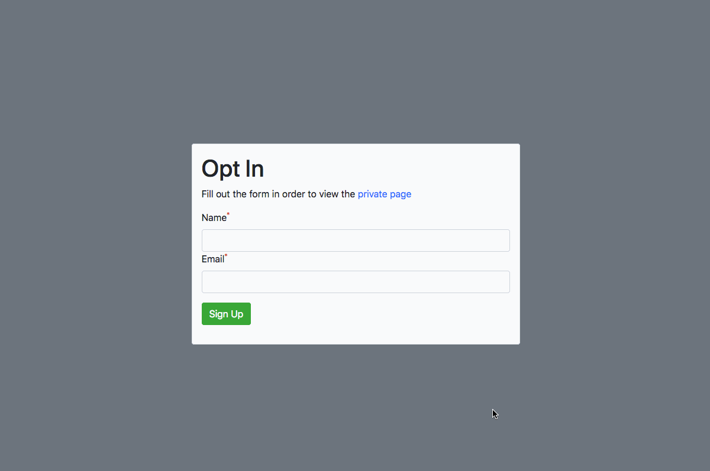

# Introduction

This codebase demonstrates how to create simple client-side "authorization". Specifically, it demonstrates how to prevent a user from viewing a specific page unless they fill out an opt-in form.

[](https://app.netlify.com/start/deploy?repository=https://github.com/stevepolitodesign/client-side-authorization/tree/netlify)



## Use Cases

This solution should only be used if your project meets the following criteria:

1. Your site is hosted at [Netlify](https://www.netlify.com/)
1. Your website is static, and is only client-side
1. You want collect leads.
1. You want to ensure the private page can't be easily accessed by bypassing the form.
1. The data on the private page is not sensitive.

## Important Notes

- Everything is client-side.
- There is no authentication.
- "Authorization" is handled through [localStorage](https://developer.mozilla.org/en-US/docs/Web/API/Window/localStorage).
- You'll want to add a `robots.txt` file and `Disallow` all private pages. This will help ensure the data won't be crawled and exposed on search engines.

---

# Documentation

1. On the page(s) with the opt-in form, add the following before the closing `</body>` tag.

```
<script src="https://code.jquery.com/jquery-3.3.1.min.js" integrity="sha256-FgpCb/KJQlLNfOu91ta32o/NMZxltwRo8QtmkMRdAu8=" crossorigin="anonymous"></script>
<script src="/js/formRedirect.js"></script>
<script>
    const form = new formRedirect('form');
</script>
```
2. `formRedirect(form)` takes the `ID`, `class` or `tag` of the `form`.
3. On the page(s) that need to be private, add the following before the closing `</head>` tag.

```
<script>
    const page = new privatePage();
</script>
```
4. `privatePage(redirectUrl, message)` takes two optional arguments:
    - `redirectUrl`: The URL to redirect to if the user is not authorized to view the page. Defaults to `/`
    - `message`: The message to display to the user before redirecting them. Defaults to `You are not authorized to view this page`

---

# Local Set Up

1. `yarn global add serve`
1. `serve`